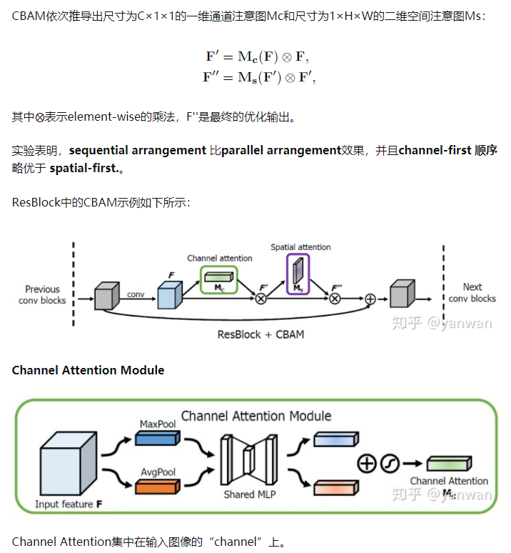
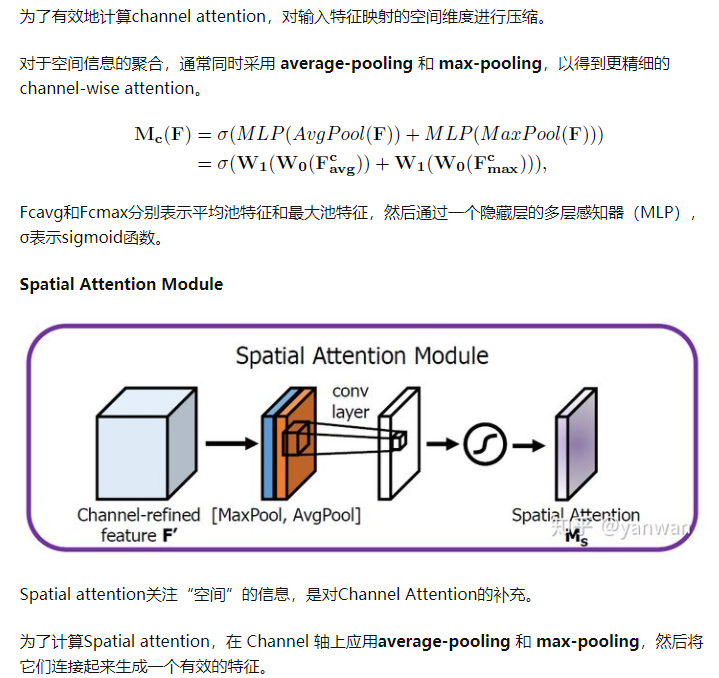
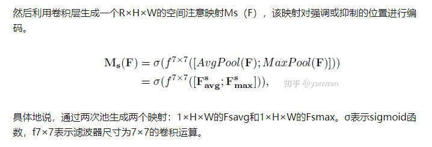

## ECCV2018 CBAM
论文：[CBAM: Convolutional Block Attention Module](https://arxiv.org/abs/1807.06521)

代码：https://github.com/luuuyi/CBAM.PyTorch

这是2018年ECCV的一篇论文，引文超过1000篇。

CBAM可以无缝地集成到任何CNN架构中，开销不会很大，而且可以与基本CNN网络一起进行端到端的训练。与SENet类似，CBAM 也是早期的Attention，没有通过复杂的相似度计算得到注意力分布。

