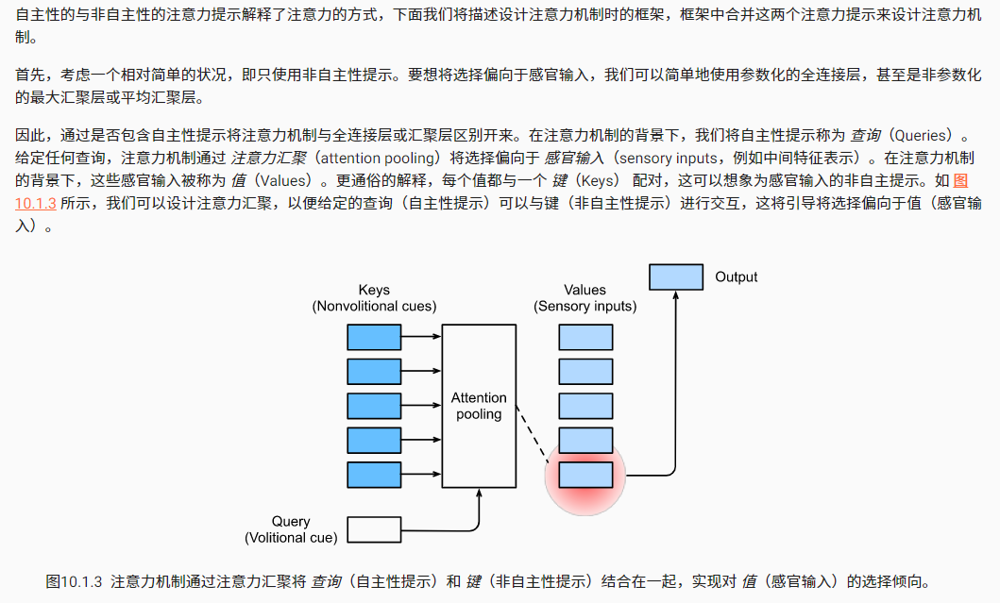

## 注意力提示（来自《dive into deep learning》）

注意力在我们的环境中是稀缺的，而环境中的信息却并不少。在检查视觉场景时，我们的视觉神经系统大约每秒收到  108  位的信息，这远远超过了大脑能够完全处理的水平。幸运的是，我们的祖先已经从经验（也称为数据）中认识到 并非感官的所有输入都是一样的。在整个人类历史中，这种只将注意力引向感兴趣的一小部分信息的能力，使我们的大脑能够更明智地分配资源来生存、成长和社交，例如发现天敌、找寻食物和伴侣。

